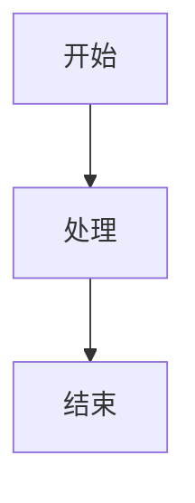

# 飞书文档格式优化 Skill 调研

> 调研日期：2026-06-25
> 核心问题：飞书 CLI 写报告样式难看，有没有专门优化格式的 Skill？
> 结论：有！找到了多个专门解决这个问题的 Skill

---

## 一、核心发现

### 🏆 最推荐的飞书文档 Skill

| Skill | Stars | 核心功能 | 适用场景 |
|-------|-------|---------|---------|
| **feishu-doc-quality** | 1 | **防止格式问题**，解决 CLI 写文档的段落合并问题 | 写报告时格式错乱 |
| **feishu-doc-writer** | 0 | **高质量业务文档写作**，去 AI 味 | 写周报、方案、汇报 |
| **feishu-max-saver-skill** | 3 | **省 token**，164 个 API 端点仅 695 tokens | 大量飞书操作 |
| **Feishu-MCP** | 695 | **完整飞书 MCP**，支持文档/任务/用户 | 全功能飞书集成 |
| **FeiShuSkill** | 38 | **飞书 Skill**，支持 MCP + CLI | 基础飞书操作 |
| **feishu-skills** | 13 | **飞书自动化**，消息/文档/任务 | 飞书自动化工作流 |

---

## 二、重点 Skill 详解

### 2.1 feishu-doc-quality — 防止格式问题 ⭐⭐⭐

**最直接解决你的问题**：CLI 写文档时格式错乱。

**核心问题**：
飞书的 Markdown Convert API 会把连续的纯文本段落合并成一个 block，用软换行分隔，而不是创建独立的段落 block。结果：
- Q&A 对变成"一大段文字"
- 表格说明被吸收到表格 block 里
- 列表和总结段落合并

**5 条写入前规则**：

| # | 场景 | 解决方案 |
|---|------|---------|
| 1 | FAQ/Q&A 对 | 转换为 `<lark-table>` |
| 2 | 表格后的文字 | 用 `<callout>` 包裹或加粗关键词 |
| 3 | 列表后的总结 | 第一句话加粗关键词 |
| 4 | 连续纯文本段落 | 插入 `---` 分隔线或 callout |
| 5 | 写入方法 | 用 `-f file.md` 而不是 `-c` 内联 |

**写入后验证流程**：
1. 写入后执行 `feishu fetch` 检查 block 结构
2. 检测合并的 block（连续行没有空行分隔）
3. 用 `replace`、`delete`、`insert` 命令修复

**安装**：
```bash
git clone https://github.com/jasonhilios/feishu-doc-quality.git
cp -r feishu-doc-quality/SKILL.md ~/.claude/skills/feishu-doc-quality/
cp -r feishu-doc-quality/reference ~/.claude/skills/feishu-doc-quality/
```

**GitHub**: https://github.com/jasonhilios/feishu-doc-quality

---

### 2.2 feishu-doc-writer — 高质量业务文档写作 ⭐⭐⭐

**最直接解决你的问题**：写出来的报告 AI 味重、不专业。

**核心功能**：
- 重写、起草和优化业务文档
- 去除 AI 味，让文档更清晰自然
- 支持周报、项目雷达、会议材料、业务复盘等

**核心原则**：

1. **先想读者和目的**，再写正文
2. **先写 200-500 字的故事线**，再扩展结构
3. **标题要有观点**，不要只是标签
4. **结论先行**，压缩背景
5. **用数字、例子、负责人、时间节点**，不要用模糊形容词
6. **表格、列表、callout、board** 只在降低阅读成本时才用
7. **去 AI 味需要具体和克制**，不是只是随意化

**支持的文档类型**：
- 规划/复盘文档
- 决策文档
- 项目计划
- 周报/双周报
- 会议纪要
- SOP 文档
- 深度分析

**安装**：
```bash
git clone https://github.com/SwirlingLight/feishu-doc-writer.git ~/.codex/skills/feishu-doc-writer
```

**使用方式**：
```
# 重写飞书文档
> 用 $feishu-doc-writer 重写这篇飞书文档：<飞书链接>

# 去 AI 味
> 帮我把这篇飞书业务文档改得更清晰、更少 AI 味：<飞书链接>

# 整理笔记成报告
> 用 $feishu-doc-writer 把下面这些要点整理成一篇项目周报
```

**GitHub**: https://github.com/SwirlingLight/feishu-doc-writer

---

### 2.3 feishu-max-saver-skill — 省 token 飞书 Skill ⭐⭐

**核心优势**：164 个 API 端点仅占用 695 tokens（官方方案 15,000+ tokens）。

**三大设计决策**：
1. **两层加载**：轻量 SKILL.md（695 tokens）常驻，详细命令按需读取
2. **CLI 代替 MCP**：不需要预加载 JSON Schema
3. **按需触发**：只在提到"飞书"时加载，用完卸载

**支持的功能**：
- 文档操作：搜索、创建、更新、插入图片/文件、Markdown 转 Block
- 多维表格：搜索记录、批量操作、字段和视图管理
- 消息：发送、回复、转发、撤回、已读回执、表情回应
- 日历：事件列表、忙闲查询、参会人管理、视频会议预约
- 邮件：发送、收件箱、草稿管理
- 企业管理：OKR、考勤、审计日志、部门统计

**内置工作流模板**：
- 会议纪要聚合（日历 → 视频会议 → 转录 → 报告）
- 站会每日摘要（日历 + 任务 → 摘要）
- 图表插入文档（Mermaid → PNG → 图片上传 → block 创建）

**安装**：
```bash
# 通过 OpenSkills CLI
npm i -g openskills
openskills install d-wwei/feishu-max-saver-skill
```

**GitHub**: https://github.com/d-wwei/feishu-max-saver-skill

---

### 2.4 Feishu-MCP — 完整飞书 MCP 服务 ⭐⭐

**Stars**: 695 | **语言**: TypeScript

**核心功能**：
- 文档管理：创建、读取、编辑、搜索
- 任务管理：创建、更新、删除
- 用户信息：搜索、批量获取
- 知识库：Wiki 操作

**格式支持**：
- 文本样式：加粗、斜体、下划线、删除线、行内代码
- 文本颜色：灰色、棕色、橙色、黄色、绿色、蓝色、紫色
- 对齐：左对齐、居中、右对齐
- 标题：1-9 级
- 代码块：多语言语法高亮
- 列表：有序和无序
- 图片：本地文件和网络 URL
- 公式：LaTeX 语法
- Mermaid 图：流程图、时序图、思维导图、类图、饼图
- 表格：多行，单元格可包含文本、标题、列表、代码块
- 飞书画板/画布：丰富的视觉内容

**CLI 模式**：
```bash
feishu-tool <tool-name> '<json>'
```

**安装**：
```bash
npm install feishu-mcp
```

**GitHub**: https://github.com/cso1z/Feishu-MCP

---

### 2.5 FeiShuSkill — 飞书 Skill ⭐

**Stars**: 38

**核心功能**：
- 多维表格操作：创建表格、查询/添加/编辑/删除记录
- 消息：发送文本和富文本消息
- 文档管理：搜索文档、获取内容
- 群组管理：创建群组、管理成员
- 权限控制：添加协作者、设置访问权限
- 通讯录：通过邮箱或手机号查找用户
- 知识库：搜索 Wiki、获取节点信息

**安装**：
```bash
npm i -g openskills
openskills install whatevertogo/FeiShuSkill
```

**GitHub**: https://github.com/whatevertogo/FeiShuSkill

---

## 三、飞书文档格式问题与解决方案

### 3.1 常见格式问题

| 问题 | 原因 | 解决方案 |
|------|------|---------|
| 段落合并成一大段 | 飞书 API 把连续纯文本合并 | 用 `---` 分隔或 callout 包裹 |
| Q&A 变成一大段 | 没有空行分隔 | 用 `<lark-table>` 替代 |
| 表格说明被吸收 | 说明文字紧跟表格 | 用 callout 包裹或加粗关键词 |
| 列表和总结合并 | 总结紧跟列表 | 第一句话加粗关键词 |
| 代码块格式错乱 | 代码块后没有空行 | 代码块前后加空行 |

### 3.2 飞书扩展 Markdown 语法

飞书支持一些扩展 Markdown 语法：

```markdown
# Callout（高亮块）
> [!NOTE]
> 这是一个注意提示

> [!TIP]
> 这是一个技巧提示

> [!WARNING]
> 这是一个警告提示

# 表格
| 列1 | 列2 | 列3 |
|-----|-----|-----|
| 数据1 | 数据2 | 数据3 |

# 代码块
```python
def hello():
    print("Hello, World!")
```

# Mermaid 图


# LaTeX 公式
$E = mc^2$

# 分隔线
---
```

### 3.3 写入飞书的最佳实践

1. **用 `-f file.md` 而不是 `-c` 内联**
   - 文件方式写入格式更稳定
   - 避免命令行转义问题

2. **段落之间加空行**
   - 确保每个段落是独立的 block
   - 避免飞书 API 合并段落

3. **用 callout 包裹重要信息**
   - 结论、警告、提示用 callout
   - 视觉上更突出

4. **用表格替代 Q&A 对**
   - 避免 Q&A 合并成一大段
   - 表格格式更清晰

5. **标题要有观点**
   - 不要只是"问题分析"
   - 要是"问题根因：XXX 导致 YYY"

6. **结论先行**
   - 第一句话就是结论
   - 后面再展开细节

---

## 四、推荐组合方案

### 4.1 写测评报告

```
feishu-doc-quality（防止格式问题）
+ feishu-doc-writer（高质量业务文档写作）
+ ai-eval-report Skill（测评报告生成器）
```

**流程**：
1. 用 `ai-eval-report` 生成测评报告内容
2. 用 `feishu-doc-writer` 优化文档质量
3. 用 `feishu-doc-quality` 确保格式正确
4. 写入飞书

### 4.2 写周报/汇报

```
feishu-doc-writer（去 AI 味、专业写作）
+ feishu-doc-quality（防止格式问题）
```

### 4.3 大量飞书操作

```
feishu-max-saver-skill（省 token）
+ Feishu-MCP（完整功能）
```

---

## 五、安装指南

### 5.1 安装 feishu-doc-quality

```bash
# 克隆仓库
git clone https://github.com/jasonhilios/feishu-doc-quality.git

# 复制到 Claude Code skills 目录
mkdir -p ~/.claude/skills/feishu-doc-quality
cp feishu-doc-quality/SKILL.md ~/.claude/skills/feishu-doc-quality/
cp -r feishu-doc-quality/reference ~/.claude/skills/feishu-doc-quality/

# 重启 Claude Code
```

### 5.2 安装 feishu-doc-writer

```bash
# 克隆仓库
git clone https://github.com/SwirlingLight/feishu-doc-writer.git

# 复制到 Codex skills 目录
mkdir -p ~/.codex/skills/feishu-doc-writer
cp -r feishu-doc-writer/* ~/.codex/skills/feishu-doc-writer/

# 重启 Codex
```

### 5.3 安装 feishu-max-saver-skill

```bash
# 通过 OpenSkills CLI
npm i -g openskills
openskills install d-wwei/feishu-max-saver-skill
```

### 5.4 安装 Feishu-MCP

```bash
# 安装 npm 包
npm install feishu-mcp

# 配置环境变量
export FEISHU_APP_ID=your_app_id
export FEISHU_APP_SECRET=your_app_secret
export FEISHU_AUTH_TYPE=user

# 启动 MCP 服务
npx feishu-mcp
```

---

## 六、参考资料

| 工具 | Stars | 链接 |
|------|-------|------|
| Feishu-MCP | 695 | https://github.com/cso1z/Feishu-MCP |
| FeiShuSkill | 38 | https://github.com/whatevertogo/FeiShuSkill |
| feishu-skills | 13 | https://github.com/fingertap/feishu-skills |
| feishu-doc-quality | 1 | https://github.com/jasonhilios/feishu-doc-quality |
| feishu-max-saver-skill | 3 | https://github.com/d-wwei/feishu-max-saver-skill |
| feishu-doc-writer | 0 | https://github.com/SwirlingLight/feishu-doc-writer |
| feishu2md | 2.2k | https://github.com/Wsine/feishu2md |
| elog | 1.9k | https://github.com/LetTTGACO/elog |
